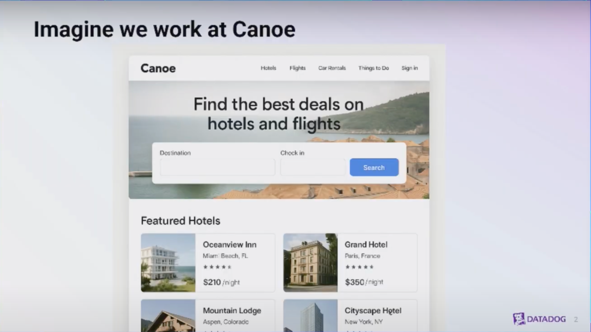
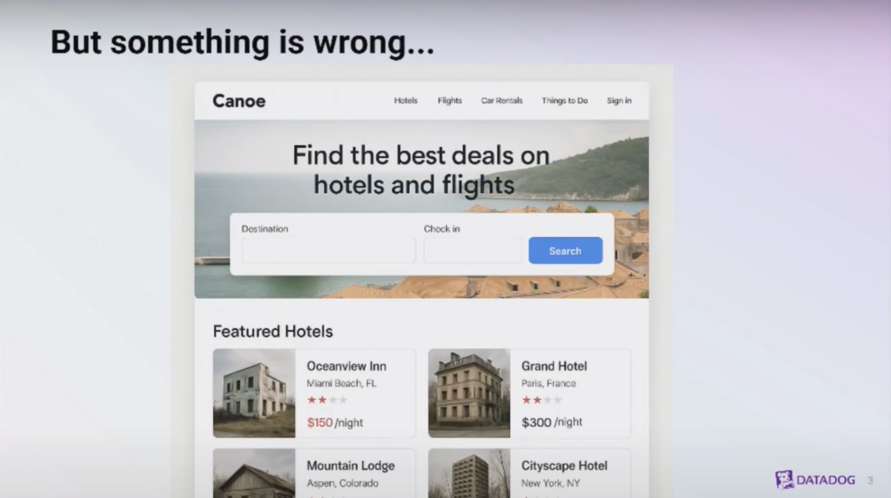
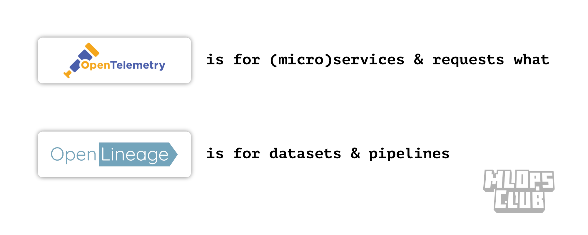
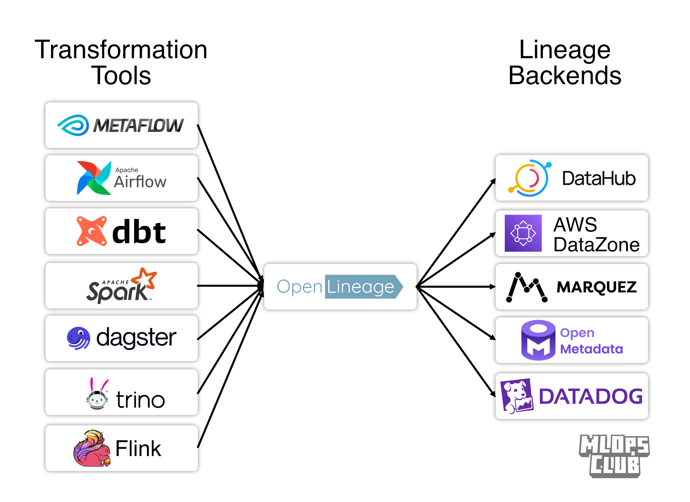
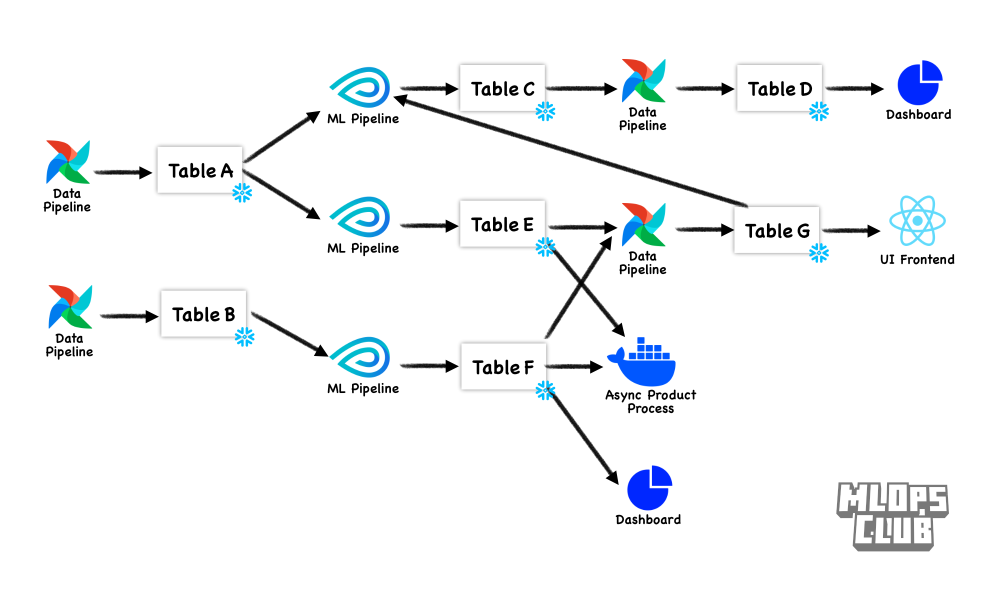

## [Placeholder title] Why and How of data lineage for DS

## What does a "data outage" look like?

- Nothing is crashing
- Nothing is slow

It is worse. 

1. Users can still load the app quickly. 
2. The pipeline still runs.
3. The CEO can still see the dashboard. 

But

1. Users are shown misleading information
   1. Apple Maps [led users into the desert](https://www.cnn.com/2012/12/10/tech/apple-maps-australia-flaw) putting them in a life threatening situation. Google Maps has had [similar](https://www.cbsnews.com/losangeles/news/google-maps-mistake-leaves-dozens-of-families-stranded-in-the-desert/).
   2. If AirBnB, Amazon.com, Netflix, Booking.com, DoorDash--or any app making personalized recommendations--recommended junk (low rated) listings to guests, they have bad experiences and the company loses money
2. Automatic bad decisions are made
   1. The ad spend pipeline made bad bets, spending $$$ on keywords with low ROI
   2. The demand forecasting pipeline overestimated--now we are paying to store unsold stock in a warehouse
   3. Zillow bought millions of $ worth of overvalued homes during COVID. The CEO (paraphrased) "This may not be a business we should be in."
   4. 
3. Manual bad decisions are made--or anger
   1. Wait! Our pipeline is only half of what our dashboard has been showing?? (real story)
   2. The report is **stale**--its counts are actually only including the last quarter.

^^^ Ask Linkedin to share stories of failures and root causes. Ask MLOps Community via a survey as well. Tag people working at vendors.

From a DataDog talk where they announced a preview feature for data observability (link), here is a fake Booking.com clone for flights and hotels. Bad listings are being surfaced.

## How do these outages happen?

## Lineage Benefit 1: Know which pipelines consume which tables/files/etc.

