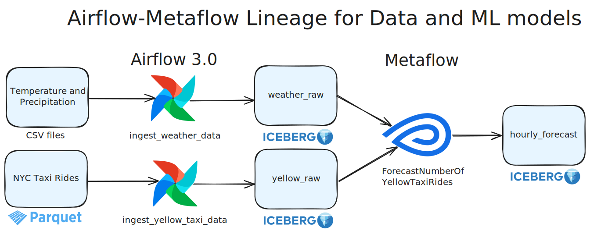
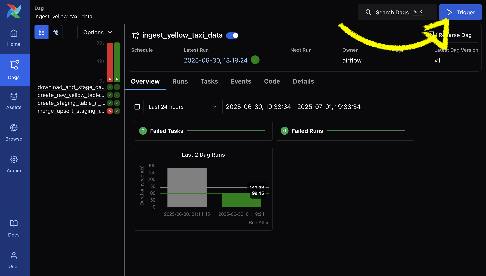
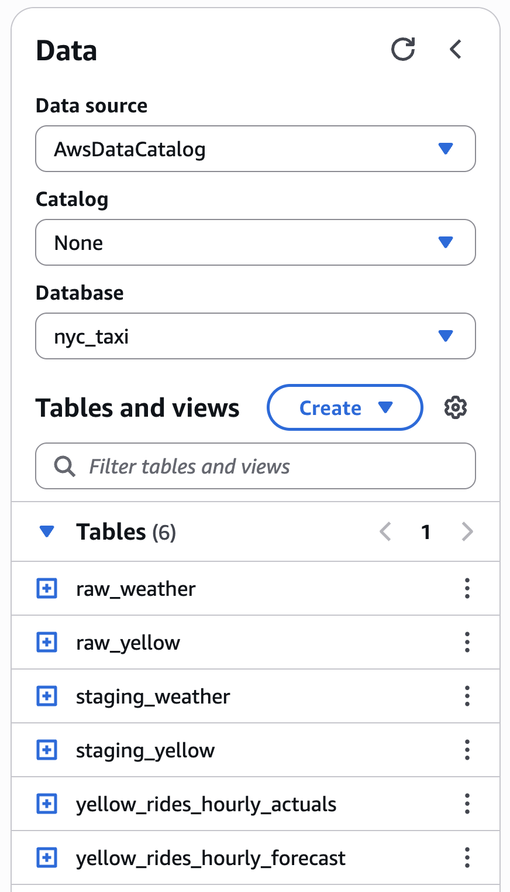

This project will demonstrate how to capture and visualize data asset lineage between assets that are produced and consumed by 2+ workflow orchestration tools. 

The assets will include files, iceberg lakehouse tables on AWS Glue/S3, and ML models.

In this case, we will use

**Apache Airflow 3.0** which has already built integrations for **OpenLineage** and **DataHub**.

**Metaflow** which we will instrument with OpenLineage ourselves to send to **DataHub** and another OpenLineage backend.

## The pipeline

We are doing forecasting on the NYC Yellow Taxi trips dataset.

For each of ~50 pickup locations in NYC, the pipeline attempts to predict the number of taxi rides that will happen for each hour of the day.

E.g. predict that pickup location `1` will have `3` rides at `2025-06-01 8:00 AM`, `5` rides at `2025-06-01 9:00 AM`, etc.

### The pipeline's lineage

To ingest the data and produce these inferences, there are a number of intermediary files, tables, and a ML model.

The relationship between these may change as a data scientist iterates, e.g. our baseline model may not use the weather data at all, but a later iteration might. 

That evolution should be automatically shown in lineage via versioning.

## Running the project

Prerequisites

1. AWS CLI with a profile called `sandbox` (`aws configure sso --profile sandbox`), used to
   1. create an s3 bucket
   2. create a glue database
   3. execute Athena queries to create/read tables in that database
   4. list/create files in the s3 bucket
2. `uv`

### Step 1 - One-time (ish) Setup

```bash
uv sync --all-groups

# uses the sandbox profile to create an S3 bucket and Glue Database
bash run create-infra  # destroy-infra is also a command 

# create an airflow sqlite db and seed it with some variables needed for the DAGs
bash run init-airflow
```

### Step 2 - Run the Airflow DAGs

```bash
# start the airflow UI
bash run airflow standalone
```

You can see the UI at [`localhost:8080`](http://localhost:8080) 
- username: `admin`
- passwored: `admin`

Now trigger each of the Airflow DAGs via the UI

1. Temperature/Precipitation: http://localhost:8080/dags/ingest_weather_data
2. Yellow Taxi Trips: http://localhost:8080/dags/ingest_yellow_taxi_data



Go preview your data in athena [here](https://us-east-1.console.aws.amazon.com/athena/home?region=us-east-1#/query-editor/)

### Step 3 - Run the Metaflow flow

```bash
bash run training-flow run
```

### Done! 🎉

These tables should all be visible [in Athena/Glue](https://us-east-1.console.aws.amazon.com/athena/home?region=us-east-1#/query-editor/)!



## OpenLineage Diagram

```mermaid
graph TD
    %% External Data Sources
    TLC[("📁 External File<br/><b>Name:</b> NYC TLC / Yellow Taxi Trip Data<br/><b>Storage Format:</b> Parquet<br/><b>Storage:</b> <code>d37ci6vzurychx.cloudfront.net/trip-data/yellow_tripdata_YYYY-MM.parquet</code>")]
    WEATHER[("📁 External File<br/><b>Name:</b> external.weather_data<br/><b>Storage Format:</b> JSON/CSV<br/><b>Storage:</b>")]

    %% Airflow DAGs
    TAXI_DAG["🔄 <b>OL Namespace:</b> ingest_yellow_taxi_data<br/><b>Frequency:</b> @monthly<br/><b>Integration:</b> AIRFLOW<br/><b>Processing type:</b> BATCH<br/><b>Job type:</b> DAG"]
    WEATHER_DAG["🔄 <b>OL Namespace:</b> ingest_weather_data<br/><b>Frequency:</b> @daily<br/><b>Integration:</b> AIRFLOW<br/><b>Processing type:</b> BATCH<br/><b>Job type:</b> DAG"]

    %% Airflow Tasks
    TAXI_MERGE["📋 <b>OL Namespace:</b> ingest_yellow_taxi_data.merge_upsert_staging_into_raw_yellow<br/><b>Frequency:</b> @monthly<br/><b>Integration:</b> AIRFLOW<br/><b>Processing type:</b> BATCH<br/><b>Job type:</b> TASK"]
    WEATHER_MERGE["📋 <b>OL Namespace:</b> ingest_weather_data.merge_upsert_staging_into_raw_weather<br/><b>Frequency:</b> @daily<br/><b>Integration:</b> AIRFLOW<br/><b>Processing type:</b> BATCH<br/><b>Job type:</b> TASK"]

    %% Staging Tables
    TAXI_STAGING[("🗃️ Staging Table<br/><b>Athena Name:</b> awscatalog.nyc_taxi.yellow_taxi_staging<br/><b>Glue Name:</b> table/nyc_taxi/yellow_taxi_staging<br/><b>Catalog:</b> arn:aws:glue:us-east-1:123456789012<br/><b>Warehouse:</b> awsathena://athena.us-east-1.amazonaws.com<br/><b>Storage Format:</b> Iceberg/Parquet<br/><b>Storage:</b> s3://airflow-metaflow-6721/iceberg/yellow_taxi_staging/")]
    WEATHER_STAGING[("🗃️ Staging Table<br/><b>Athena Name:</b> awscatalog.nyc_taxi.weather_staging<br/><b>Glue Name:</b> table/nyc_taxi/weather_staging<br/><b>Catalog:</b> arn:aws:glue:us-east-1:123456789012<br/><b>Warehouse:</b> awsathena://athena.us-east-1.amazonaws.com<br/><b>Storage Format:</b> Iceberg/Parquet<br/><b>Storage:</b> s3://airflow-metaflow-6721/iceberg/weather_staging/")]

    %% Raw Tables
    TAXI_RAW[("🗃️ Raw Table<br/><b>Athena Name:</b> awscatalog.nyc_taxi.yellow_taxi_raw<br/><b>Glue Name:</b> table/nyc_taxi/yellow_taxi_raw<br/><b>Catalog:</b> arn:aws:glue:us-east-1:123456789012<br/><b>Warehouse:</b> awsathena://athena.us-east-1.amazonaws.com<br/><b>Storage Format:</b> Iceberg/Parquet<br/><b>Storage:</b> s3://airflow-metaflow-6721/iceberg/yellow_taxi_raw/")]
    WEATHER_RAW[("🗃️ Raw Table<br/><b>Athena Name:</b> awscatalog.nyc_taxi.weather_raw<br/><b>Glue Name:</b> table/nyc_taxi/weather_raw<br/><b>Catalog:</b> arn:aws:glue:us-east-1:123456789012<br/><b>Warehouse:</b> awsathena://athena.us-east-1.amazonaws.com<br/><b>Storage Format:</b> Iceberg/Parquet<br/><b>Storage:</b> s3://airflow-metaflow-6721/iceberg/weather_raw/")]

    %% Metaflow Flow Steps
    COMPUTE_ACTUALS["🤖 <b>OL Namespace:</b> TrainForecastModelFlow.compute_actuals<br/><b>Frequency:</b> @adhoc<br/><b>Integration:</b> METAFLOW<br/><b>Processing type:</b> BATCH<br/><b>Job type:</b> STEP"]
    PREPARE_TRAINING["🤖 <b>OL Namespace:</b> TrainForecastModelFlow.prepare_training_data<br/><b>Frequency:</b> @adhoc<br/><b>Integration:</b> METAFLOW<br/><b>Processing type:</b> BATCH<br/><b>Job type:</b> STEP"]
    WRITE_FORECASTS["🤖 <b>OL Namespace:</b> TrainForecastModelFlow.write_forecasts_to_table<br/><b>Frequency:</b> @adhoc<br/><b>Integration:</b> METAFLOW<br/><b>Processing type:</b> BATCH<br/><b>Job type:</b> STEP"]

    %% Analytics Tables
    ACTUALS[("📊 Analytics Table<br/><b>Athena Name:</b> awscatalog.nyc_taxi.yellow_rides_hourly_actuals<br/><b>Glue Name:</b> table/nyc_taxi/yellow_rides_hourly_actuals<br/><b>Catalog:</b> arn:aws:glue:us-east-1:123456789012<br/><b>Warehouse:</b> awsathena://athena.us-east-1.amazonaws.com<br/><b>Storage Format:</b> Iceberg/Parquet<br/><b>Storage:</b> s3://airflow-metaflow-6721/iceberg/yellow_rides_hourly_actuals/")]
    FORECASTS[("📈 Forecast Table<br/><b>Athena Name:</b> awscatalog.nyc_taxi.yellow_rides_hourly_forecast<br/><b>Glue Name:</b> table/nyc_taxi/yellow_rides_hourly_forecast<br/><b>Catalog:</b> arn:aws:glue:us-east-1:123456789012<br/><b>Warehouse:</b> awsathena://athena.us-east-1.amazonaws.com<br/><b>Storage Format:</b> Iceberg/Parquet<br/><b>Storage:</b> s3://airflow-metaflow-6721/iceberg/yellow_rides_hourly_forecast/")]

    %% Data Flow Connections
    TLC --> TAXI_DAG
    WEATHER --> WEATHER_DAG
    
    TAXI_DAG --> TAXI_STAGING
    TAXI_STAGING --> TAXI_MERGE
    TAXI_MERGE --> TAXI_RAW
    
    WEATHER_DAG --> WEATHER_STAGING
    WEATHER_STAGING --> WEATHER_MERGE
    WEATHER_MERGE --> WEATHER_RAW
    
    TAXI_RAW --> COMPUTE_ACTUALS
    WEATHER_RAW --> COMPUTE_ACTUALS
    
    COMPUTE_ACTUALS --> ACTUALS
    ACTUALS --> PREPARE_TRAINING
    
    PREPARE_TRAINING --> WRITE_FORECASTS
    WRITE_FORECASTS --> FORECASTS

    %% Styling
    classDef dataset fill:#e3f2fd,stroke:#1565c0,stroke-width:2px,text-align:left
    classDef job fill:#e8f5e8,stroke:#2e7d32,stroke-width:2px,text-align:left

    class TLC,WEATHER,TAXI_STAGING,WEATHER_STAGING,TAXI_RAW,WEATHER_RAW,ACTUALS,FORECASTS dataset
    class TAXI_DAG,WEATHER_DAG,TAXI_MERGE,WEATHER_MERGE,COMPUTE_ACTUALS,PREPARE_TRAINING,WRITE_FORECASTS job
```



This diagram is hand-wavy:

1. The *entire* Airflow DAG is shown as ingesting the raw data and writing to a table.
   1. This is true, but the individual tasks are not represented.
   2. Later on, individual tasks are shown as though they are somehow downstream
      from the entire DAG. This is not true.
2. The entire Metaflow Flow is NOT represented, but instead individual steps are shown.
   1. This presents a problem via two steps that happen in a row who work against
      the same dataset (one reads, the next writes). Marquez would not show these
      two steps as correlated because there is no dataset between them 🤔
3. The Metaflow flow does not actually touch the weather data (yet). 
   1. It could and it will, but right now, for each pickup location and hour, it simply predicts the value from 7 days prior (this is called the "seasonal naive forecast" which we are using as a baseline).

**Insight:** not every pair of steps is connected by a shared input/output. How will we
represent this in OpenLineage and DataHub?


## DataHub Integration

Resources

- [Airflow-DataHub integration docs](https://docs.datahub.com/docs/lineage/airflow)
- [Datahub Docker Quickstart](https://docs.datahub.com/docs/quickstart)

## OpenLineage

```
START Flow (root)
   START    start
   COMPLETE start
   START    step_1
       START    query_1
       COMPLETE query_1
       START    query_2
       COMPLETE query_2
       ...
   COMPLETE step_1
   ...
   START    end
   COMPLETE end
COMPLETE Flow
```