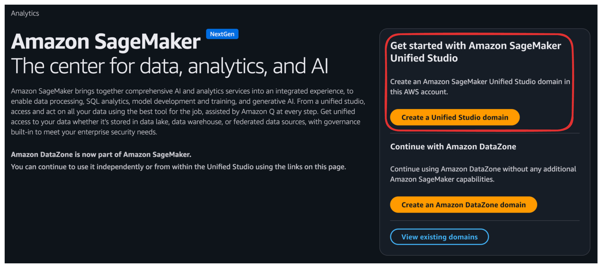
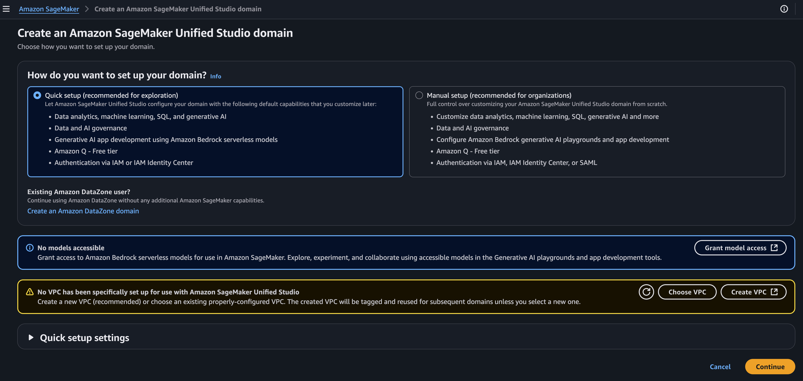
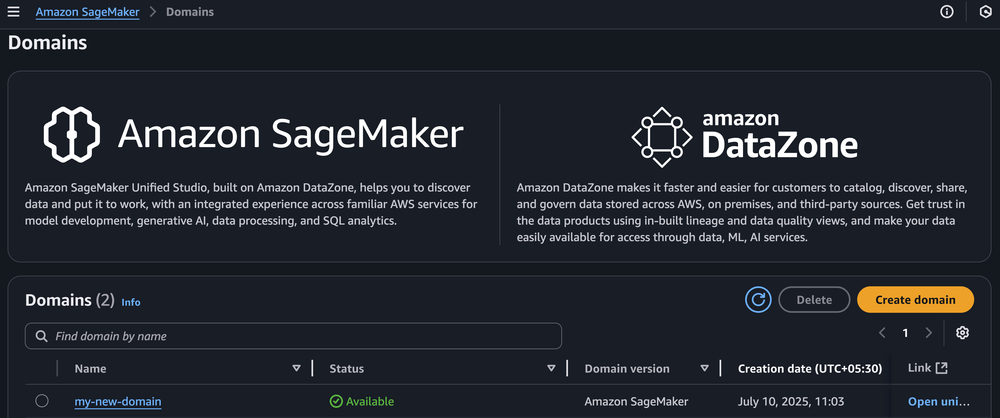
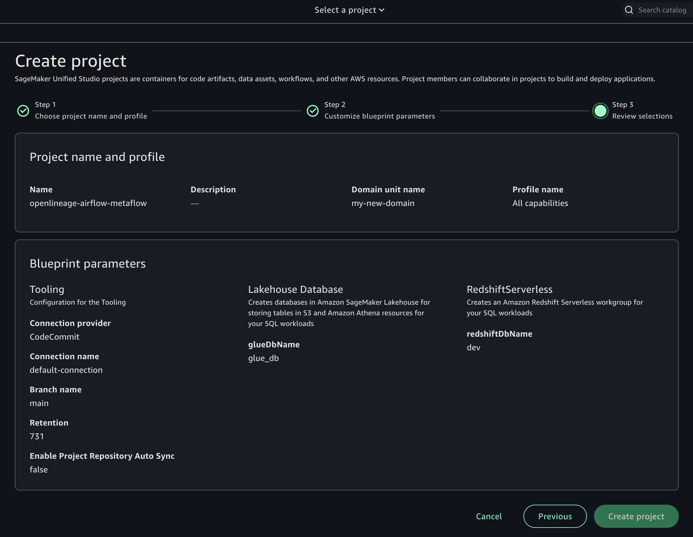
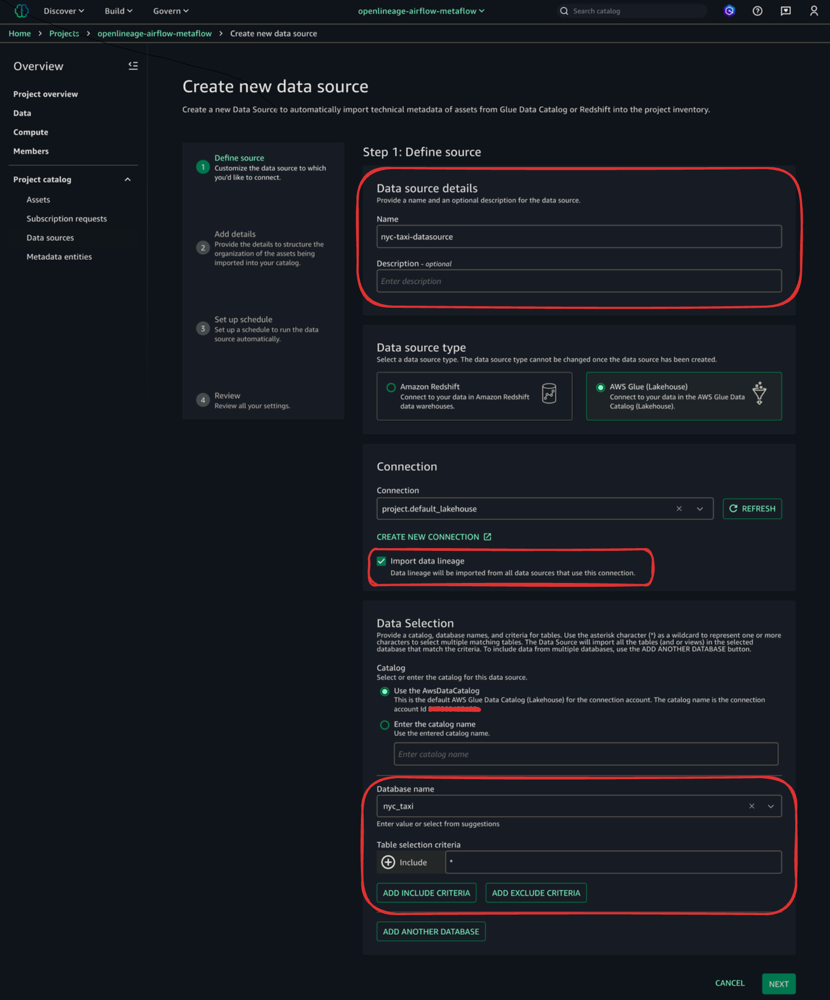
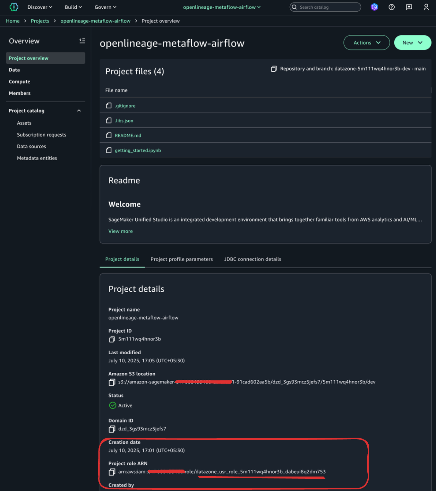
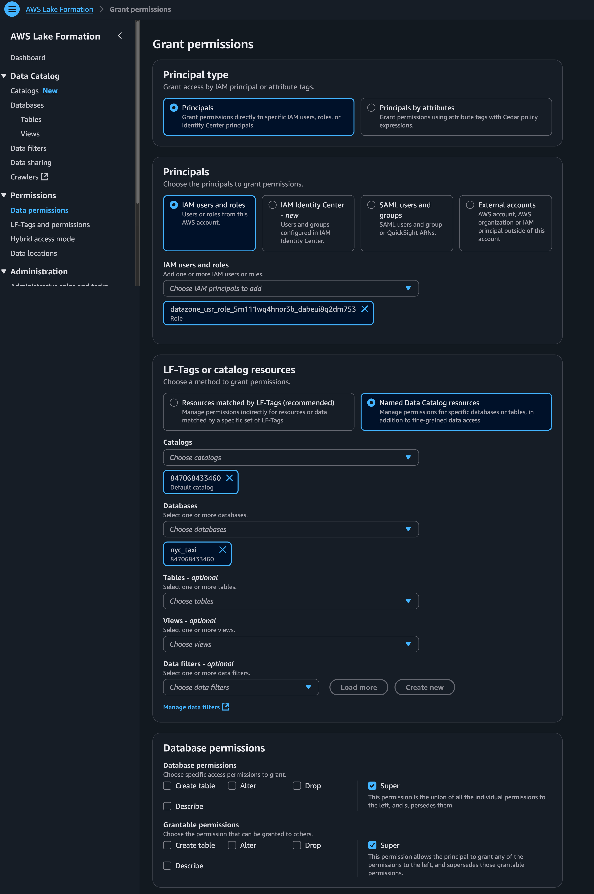
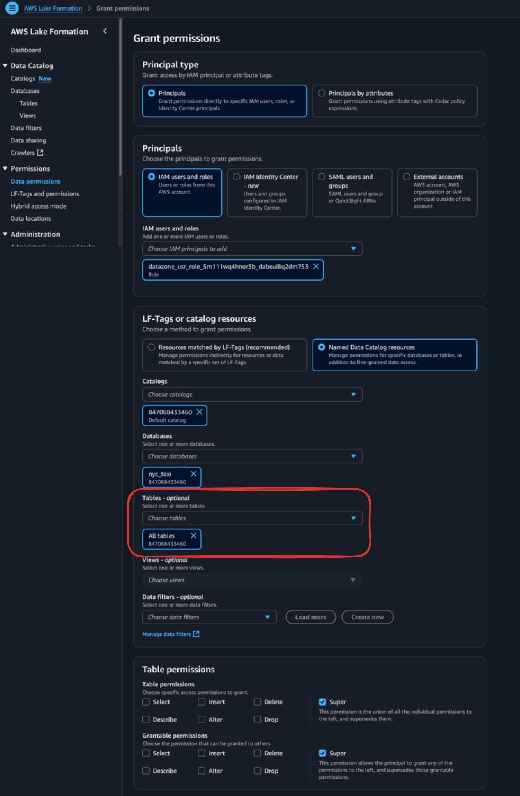
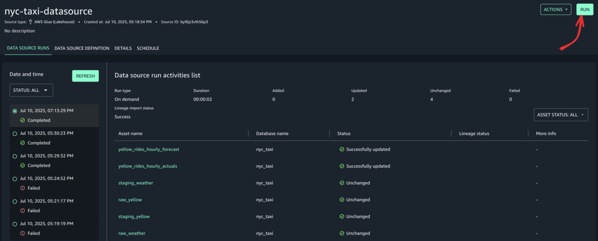

# Setting up AWS DataZone

1. Go to the [AWS SageMaker Unified Studio](https://us-east-1.console.aws.amazon.com/datazone/home?region=us-east-1#/).

   

2. Create a new Unified Studio Domain with the Quick setup settings.
      - If you want, you can provide a meaningful domain name.
      - And you'll need to provide a VPC and subnets.

   

3. Click on Continue and hurray🎉 we have a Sagemaker Unified Studio domain!
The domain URL should look like this: `https://<domain-id>.sagemaker.<aws-region>.on.aws/`

   

   **Make sure to copy the domain ID and paste it in the [run script](./run) as the value for `DATAZONE_DOMAIN_ID=<your-domain-id>`.**

4. We will sign in into our domain and create a new Sagemaker Studio Project with the default settings.

   

5. Once the project is created, we will have to add our Glue database as a data source.

   1. Click on the `Data Sources` tab in the left sidebar under `Project catalog`.
   2. Click on `Add Data Source`.
   3. Select `AWS Glue (Lakehouse)` in the `Data source type` section.
   4. In the `Database name` field, you'll have to write the Glue database name (`nyc_taxi`) that we created earlier using `./run create-infra`.
   5. Click on `Next` and use the default settings.
   6. Review the settings and click on `Create`.

   

6. Next, we will have to give the datazone-user access to the Glue database.

   1. In `Project overview` tab, under `Project details`, you will see `Project role ARN`.
   2. Copy the datazone-user from the ARN. It should look like this: `datazone_usr_role_<some-suffix>`.

      

   3. Now, in the AWS Lake Formation console, go to the `Data permissions` tab.
   4. Click on `Grant` and select the datazone-user role that we copied earlier in `IAM users and roles` section.
   5. Under `Named Catalog resources`, select your default catalog (usually `AwsDataCatalog`) and Glue database (`nyc_taxi`).
   6. For now, we will grant `Super` permissions under `Database permissions` tab.
   7. Click on `Grant` to save the permissions.

      

   8. We will repeat the same steps[3-7] and this time grant table-level permissions to the datazone-user role.

      

7. Now, we can click on the `Run` button in our newly created Data Source to see the tables in our Glue database.

      
